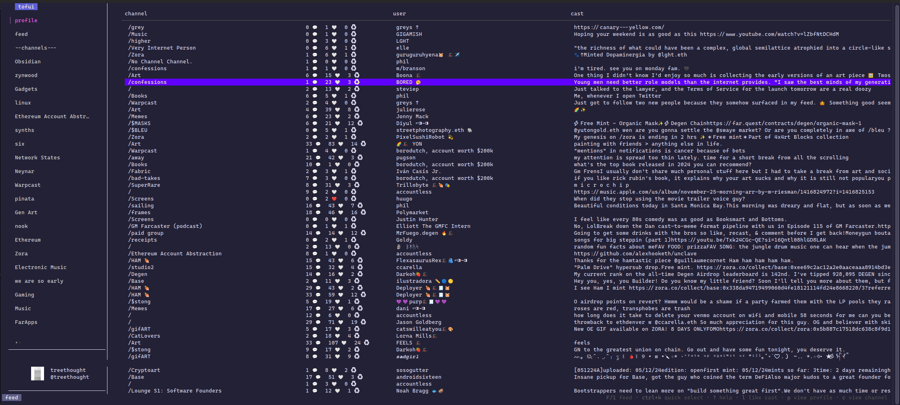

# tofui

tofui (Terminally On Farcaster User Interface) is a TUI for [farcaster](https://www.farcaster.xyz/).

It supports running locally using your own [Neynar](https://neynar.com/) application, or as a hosted SSH app using [wish](https://github.com/charmbracelet/wish)




## Hosted version

Use a hosted instance of tofui over ssh

```
ssh -p 42069 tofui.xyz
```

### SSH Sessions, Authentication and Details

Each SSH session is authenticated via it's SSH public key. The session then receives it's own [Bubble Tea](https://github.com/charmbracelet/bubbletea) which provides the interface. 

For authorization, the app directs you to create a signer via Neynar's [SIWN](https://docs.neynar.com/docs/how-to-let-users-connect-farcaster-accounts-with-write-access-for-free-using-sign-in-with-neynar-siwn). This signer is created and managed by Neynar, and is used to provide tofui access to your farcaster account via it's API.

This is done when both running locally and over SSH, and the signer is specific to whichever app credentials were used. This would be tofui over SSH, or your own app when running locally. 


the tofui instance (local or hosted) uses the configured Neynar app credentials to obtain a signer via 
## Running Locally

Running locally requires your own Neynar application. After creating one, copy [config.yaml.example](./config.yaml.example) to config.yaml and updating with your app's values.

### Install

Install using go
```
go install github.com/treethought/tofui@latest
```

Or clone the repo and run 
```
make build
```

Or download a binary from the [releases](https://github.com/treethought/tofui/releases) page 

Then start the TUI via `tofui`

## Keybindings

| Key       | Action                                      |
| --------- | ------------------------------------------- |
| Tab       | Toggle focus between sidebar and main panel |
| Shift-Tab | Toggle sidebar visibility                   |
| K / Up    | Move up in list                             |
| J / Down  | Move down in list                           |
| Escape    | Go to previous view                         |
| Enter     | Select current item                         |
| F<br>     | Jump to your feed                           |
| Ctrl-K    | Open channel quick switcher<br>             |
| P         | Open publish form                           |
| ?         | Open help                                   |
| c         | View channel of current item                |
| p         | View profile of current item                |
